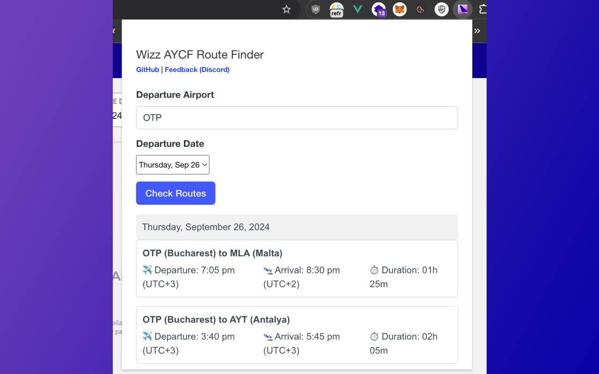

# wizz-aycf-route-finder

Simple(<1mb) Chrome extension to find all available routes on Wizz AYCF (All-You-Can-Fly).

Get from Chrome Store https://chromewebstore.google.com/detail/aycf-route-finder/ppopfobaaakhcogialemngniimoplcnp

**DISCLAIMER: This extension is not affiliated with Wizz Air or its partners in any way. It is a personal project to help Multipass users like me find available routes.**

Please use responsibly and at your own risk. Doing too many searches in a short period of time will result in temporary rate limiting.

No data is collected.

## Installation

To install this Chrome extension:

1. Download [https://github.com/vloss3/wizz-aycf-route-finder/archive/refs/tags/1.1.3.zip](https://github.com/vloss3/wizz-aycf-route-finder/archive/refs/tags/1.1.3.zip)

2. Unzip the file.

3. Open Google Chrome and navigate to `chrome://extensions/`.
3. Enable "Developer mode" by toggling the switch in the top right corner.
4. Click on "Load unpacked" button in the top left corner.
5. Select the directory containing the extension files.

The extension should now be installed and visible in your Chrome browser, click on the extension icon and make sure it's pinned.

## License

MIT License, see [LICENSE](LICENSE) file.
